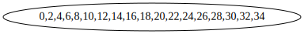
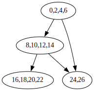
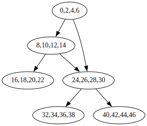

### TestCaseGeneration

## Installation

- Clone the project locally
- Create a virtual environment in the root folder: python3.10 -m venv env
- Activate the virtual environment: source env/bin/activate
- ```brew install graphviz```
- ```pip install --global-option=build_ext --global-option="-I$(brew --prefix graphviz)/include/" --global-option="-L$(brew --prefix graphviz)/lib/" pygraphviz```
- Install all packages in requirements.txt file: ```python3.10 -m pip install -r requirements.txt```
- To convert a jupyter notebook to README : ```jupyter nbconvert --execute --to markdown README.ipynb```
- To convert a jupyter notebook to python file: ```jupyter nbconvert --to script testCaseGeneration.ipynb```

## Scope

- Handles bools,int and floats
- Code shouldn't have functions
- Supports >,<,==,+,*,-,>=,<= operations
- Incase a variable can take any value
    - Floats will default to a random value between 0 to 2 in the example test case
    - Ints will default to random value between 1 to 9 in the example test case
- The type of the arguments of the function must be defined, example ```func1(a:int,b:int)```

## Examples


```python
import testCaseGeneration as TG
```


```python
def func1(a:int,b:int):
    a = a * 1
    b = b + 4
    a = a + 4
    c = a * a
    return a

(g,_,models,results) = TG.generateTestCases(func1)
print("Test Cases")
for res in results:
    print(res)
print("Display dependency graph")
g
```

    Bytecode(<function func1 at 0x1040780d0>)
    Test Cases
    [('a', '-4'), ('b', '-4')]
    Display dependency graph


    

    


```python
def func2(a:int,b:float):
    if a == 1 and b==2.3:
        b = 2
        return 233
    return 333


(g,_,models,results) = TG.generateTestCases(func2)
print("Test Cases")
for res in results:
    print(res)
print("Display dependency graph")
g
```

    Bytecode(<function func2 at 0x104078280>)
    Test Cases
    [('a', '2'), ('b', '0.18')]
    [('a', '1'), ('b', '33/10')]
    [('a', '1'), ('b', '23/10')]
    Display dependency graph


    

    


```python
def func3(a:int,b:int):
    if a == 1 and b==2:
        b = 2
        return 233
    elif b==3:
        b = 4
        return
    else:
        a = 1
    return 333

(g,_,models,results) = TG.generateTestCases(func3)
print("Test Cases")
for res in results:
    print(res)
print("Display dependency graph")
g
```

    Bytecode(<function func3 at 0x104078310>)
    Test Cases
    [('a', '2'), ('b', '3')]
    [('a', '2'), ('b', '4')]
    [('a', '1'), ('b', '3')]
    [('a', '1'), ('b', '0')]
    [('a', '1'), ('b', '2')]
    Display dependency graph


    

    


```python
def func4(a:int,b:int,c:bool):
    if a==3 or c:
        if b==4:
            return
        else:
            return
    elif a==2 and b==4:
        return
    else:
        return

(g,_,models,results) = TG.generateTestCases(func4)
print("Test Cases")
for res in results:
    print(res)
print("Display dependency graph")
g
```

    Bytecode(<function func4 at 0x1040783a0>)
    Test Cases
    [('a', '3'), ('b', '4'), ('c', 'False')]
    [('a', '3'), ('b', '5'), ('c', 'True')]
    [('a', '2'), ('b', '5'), ('c', 'False')]
    [('a', '2'), ('b', '4'), ('c', 'False')]
    [('a', '0'), ('b', '7'), ('c', 'False')]
    [('a', '4'), ('b', '4'), ('c', 'True')]
    [('a', '4'), ('b', '5'), ('c', 'True')]
    Display dependency graph


    

    


```python

```
